# Diagrama ER - SRM Credit Engine

Diagrama entidade-relacionamento derivado das migrations Flyway (V1 a V7). Cobre os quatro blocos exigidos: Moedas (`currency`, `exchange_rate`), Produtos/Tipos de Recebíveis (`pricing_parameter`, representando a regra de risco por `receivable_type`), Transações (`assignor`, `receivable`, `settlement`, `settlement_item`) e Taxas (`exchange_rate`, `pricing_parameter`).

## Diagrama

```mermaid
erDiagram
    CURRENCY ||--o{ EXCHANGE_RATE : "origin_currency_id"
    CURRENCY ||--o{ EXCHANGE_RATE : "destination_currency_id"
    CURRENCY ||--o{ RECEIVABLE : "currency_id"
    CURRENCY ||--o{ SETTLEMENT : "target_currency_id"
    CURRENCY ||--o{ SETTLEMENT_ITEM : "original_currency_id"
    CURRENCY ||--o{ SETTLEMENT_ITEM : "settlement_currency_id"

    ASSIGNOR ||--o{ RECEIVABLE : "assignor_id"
    ASSIGNOR ||--o{ SETTLEMENT : "assignor_id"

    RECEIVABLE ||--o| SETTLEMENT_ITEM : "receivable_id (unico)"

    SETTLEMENT ||--o{ SETTLEMENT_ITEM : "settlement_id"

    PRICING_PARAMETER {
        uuid id PK
        varchar receivable_type
        numeric base_rate
        numeric spread_rate
        date effective_date
    }

    CURRENCY {
        varchar id PK "codigo ISO 4217"
        varchar name
        varchar symbol
        timestamptz created_at
        timestamptz updated_at
    }

    EXCHANGE_RATE {
        uuid id PK
        varchar origin_currency_id FK
        varchar destination_currency_id FK
        numeric rate
        timestamptz rate_date_time
        timestamptz created_at
        timestamptz updated_at
    }

    ASSIGNOR {
        uuid id PK
        varchar document_number "CNPJ, unico"
        varchar name
        varchar email
        varchar phone
        timestamptz created_at
        timestamptz updated_at
    }

    RECEIVABLE {
        uuid id PK
        uuid assignor_id FK
        varchar receivable_type
        varchar document_number
        numeric face_value
        varchar currency_id FK
        date due_date
        varchar status
        timestamptz created_at
        timestamptz updated_at
    }

    SETTLEMENT {
        uuid id PK
        uuid assignor_id FK
        timestamptz settlement_date_time
        date valuation_date
        varchar target_currency_id FK
        numeric total_face_value
        numeric total_discount_amount
        numeric total_net_amount
        timestamptz created_at
        timestamptz updated_at
    }

    SETTLEMENT_ITEM {
        uuid id PK
        uuid settlement_id FK
        uuid receivable_id FK "unico"
        int term
        numeric term_months
        numeric base_rate
        numeric spread_rate
        numeric total_rate "gerada, base_rate + spread_rate"
        varchar original_currency_id FK
        numeric face_value
        numeric discount_amount
        numeric present_value
        varchar settlement_currency_id FK
        numeric exchange_rate_used
        numeric settlement_amount
        timestamptz created_at
        timestamptz updated_at
    }
```

Observação: `pricing_parameter` não possui FK física para `receivable` porque `receivable_type` é um enum de domínio (`COMMERCIAL_INVOICE`, `POST_DATED_CHECK`), não uma entidade própria. A ligação com o cálculo é feita em tempo de execução pelo `PricingStrategyResolver`, que consulta o parâmetro vigente na `effective_date` mais próxima da data de avaliação.

## Cardinalidades

| Relacionamento | Cardinalidade | Regra de negócio |
|---|---|---|
| Assignor -> Receivable | 1:N | Um cedente possui múltiplos recebíveis. |
| Assignor -> Settlement | 1:N | Um cedente pode solicitar múltiplas liquidações. |
| Receivable -> SettlementItem | 1:0..1 | Um recebível é liquidado no máximo uma vez, garantido pelo UNIQUE em `settlement_item.receivable_id`. |
| Settlement -> SettlementItem | 1:N | Uma liquidação agrupa um lote de itens. |
| Currency -> ExchangeRate | 1:N | Uma moeda participa do histórico de cotações como origem ou destino. |
| Currency -> Receivable | 1:N | Uma moeda é a moeda original de vários títulos. |
| Currency -> Settlement | 1:N | Uma moeda é a moeda alvo de várias liquidações. |
| Currency -> SettlementItem | 1:N (x2) | Uma moeda aparece como moeda original ou moeda de liquidação em vários itens. |

## Notas de modelagem

- `currency` usa chave natural (código ISO 4217) em vez de UUID, por ser tabela de referência estável.
- `settlement_item` é uma fotografia de auditoria imutável: congela taxas, prazo e valores no instante da liquidação, mesmo que `pricing_parameter` ou `exchange_rate` mudem depois.
- `total_rate` em `settlement_item` é coluna gerada (`GENERATED ALWAYS AS`), evitando divergência entre a taxa registrada e a taxa efetivamente aplicada.
- `pricing_parameter` é append-only: mudanças de taxa geram uma nova linha com nova `effective_date`, nunca um UPDATE.
- `created_at` é protegido contra alteração em todas as tabelas por trigger de banco (`prevent_created_at_update`, definida em V1), independente da camada de aplicação.
